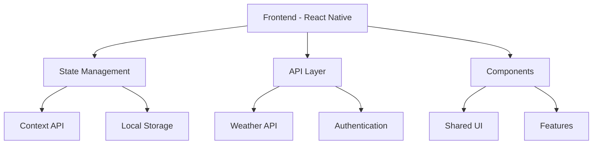
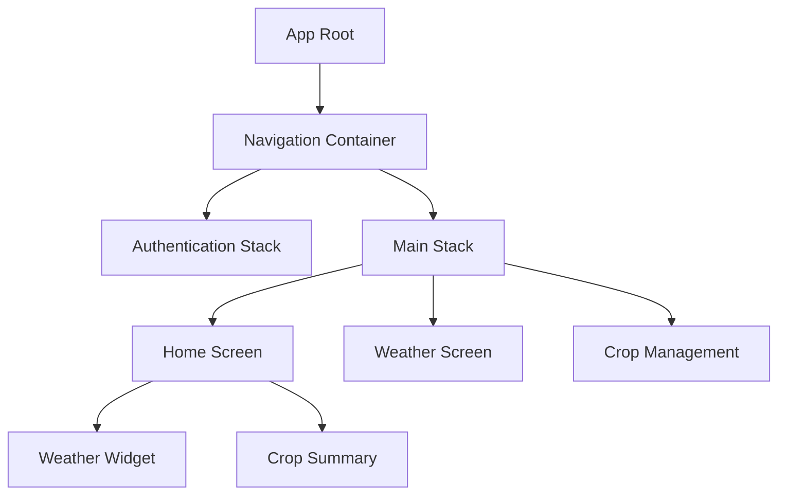
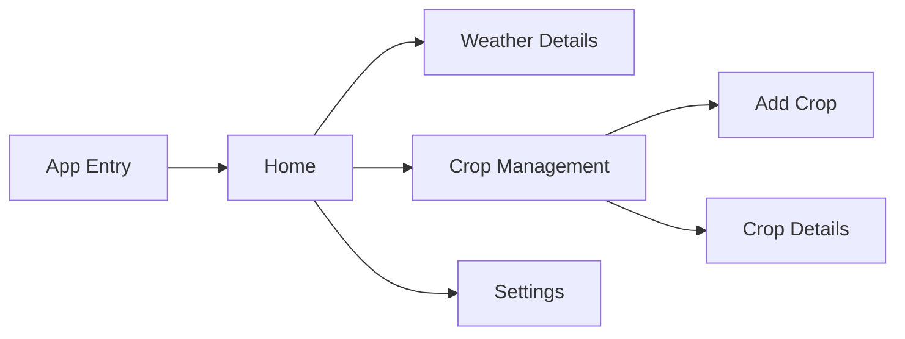

# Agriculture Project

A mobile application designed to support agricultural activities with features including weather tracking, crop management, and more.

## Features

- **Weather Tracking**: Real-time weather updates and forecasts
- **Crop Management**: Monitor and manage your crops
- **User-friendly Interface**: Intuitive design for easy navigation

## System Design

### Architecture Overview



### Component Architecture



### Navigation Routes



## Installation

### Android

Download the latest APK from here:
[Download Android APK](https://expo.dev/artifacts/eas/aPP1RogbgZwruSxuRMp3p4.apk)

### Development Setup

1. Clone the repository
   ```
   https://github.com/hitankshah/Agriculture-App
   ```

2. Install dependencies
   ```
   npm install
   ```

3. Start the development server
   ```
   npx expo start
   ```

## Technology Stack

- React Native
- Expo
- OpenWeatherMap API

## Build Configuration

The project uses EAS Build with the following configurations:
- Development: Internal APK build with development client
- Preview: Internal APK build for testing
- Production: App bundle for release

## Contributing

Contributions are welcome! Please feel free to submit a Pull Request.

## License

This project is licensed under the MIT License - see the LICENSE file for details.
